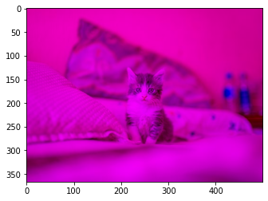
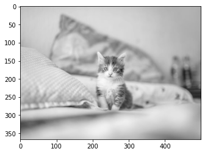

```python
! pip install opencv-python
```

    Requirement already satisfied: opencv-python in c:\users\kulsum\appdata\roaming\python\python38\site-packages (4.5.1.48)
    Requirement already satisfied: numpy>=1.17.3 in c:\users\kulsum\appdata\roaming\python\python38\site-packages (from opencv-python) (1.19.2)
    


```python
import cv2
```


```python
import numpy as np
import matplotlib.pyplot as plt
from PIL import Image  #PIL=python image library
```

# Reading an image using PIL


```python
pic=Image.open("/Users/Kulsum/Desktop/abc.jpg")
```


```python
pic
```


```python
type(pic)
```


    PIL.JpegImagePlugin.JpegImageFile


```python
pic_arr=np.array(pic)
```


```python
type(pic_arr)
```


    numpy.ndarray


```python
pic_arr.shape
```


    (367, 500, 3)


```python
plt.imshow(pic_arr)   #using plt.imshow() to read the img 
```


    <matplotlib.image.AxesImage at 0x2c8b81dedf0>


```python
plt_red=pic_arr.copy()   
```


```python
plt.imshow(plt_red[:,:,0])   #to get remove red color  from the image
```


    <matplotlib.image.AxesImage at 0x2c8b8276940>


```python
plt.imshow(plt_red[:,:,1],cmap='gray')  #to get gray color img  cmap=colormap
```


    <matplotlib.image.AxesImage at 0x2c8b82eb100>


```python
plt.imshow(plt_red[:,:,0],cmap='gray')
```


    <matplotlib.image.AxesImage at 0x2c8b8336e50>


```python
pic_arr[:,:,1]=0
plt.imshow(pic_arr) #so green is removed
```


    <matplotlib.image.AxesImage at 0x2c8b8390ca0>





```python
pic_arr[:,:,0]=1    #red is removed
plt.imshow(pic_arr)
```


    <matplotlib.image.AxesImage at 0x2c8b93bca90>


```python
pic_arr[:,:,2]=0
plt.imshow(pic_arr)
```


    <matplotlib.image.AxesImage at 0x2c8b9417880>


```python
import cv2
```


```python
img=cv2.imread("/Users/Kulsum/Desktop/abc.jpg")
```


```python
plt.imshow(img)
```


    <matplotlib.image.AxesImage at 0x2c8b9472700>


by default  matplotlib reads image in the form of R->G->B
Opencv reads image in the fom of B->G->R
so we need to transorm 
this is done by CvtColor


```python
fix_img=cv2.cvtColor(img,cv2.COLOR_BGR2RGB)
plt.imshow(fix_img)
```


    <matplotlib.image.AxesImage at 0x2c8b94ca640>


```python
img_gray=cv2.imread("/Users/Kulsum/Desktop/abc.jpg",cv2.IMREAD_GRAYSCALE)
plt.imshow(img_gray,cmap='gray')
```


    <matplotlib.image.AxesImage at 0x2c8b95264c0>





```python
plt.imshow(cv2.resize(fix_img,(1000,400)))
```


    <matplotlib.image.AxesImage at 0x2c8b96a5ca0>


# RESIZE


```python
plt.imshow(cv2.resize(fix_img,(1000,800)))
```


    <matplotlib.image.AxesImage at 0x2c8b83ca490>


# FLIP


```python
plt.imshow(cv2.flip(fix_img,0))
```


    <matplotlib.image.AxesImage at 0x2c8b82963a0>


```python
plt.imshow(cv2.flip(fix_img,1))
```


    <matplotlib.image.AxesImage at 0x2c8b96180d0>


```python
plt.imshow(cv2.flip(fix_img,-1))
```


    <matplotlib.image.AxesImage at 0x2c8b9817eb0>


```python
plt.imshow(cv2.flip(fix_img,2))
```


    <matplotlib.image.AxesImage at 0x2c8b986fb80>


```python
plt.imshow(cv2.flip(fix_img,-2))
```


    <matplotlib.image.AxesImage at 0x2c8b98c8910>


```python
fix_img.shape
```


    (367, 500, 3)


#overwriting some image on the current image


```python
fix_img[60:150,200:250]=(62,10,88)
```


```python
plt.imshow(fix_img)
```


    <matplotlib.image.AxesImage at 0x2c8b9923880>


```python
canvas=np.zeros((300,300,3),dtype='uint8')
```


```python
cv2.line(canvas,(0,0),(300,300),(0,255,0),5)
cv2.imshow("the canvas",canvas)

```


```python
cv2.rectangle(canvas,(10,10),(70,70),(0,255,0),5)
cv2.imshow("the canvas",canvas)

```


```python
cv2.circle(canvas,(150,150),50,(0,255,0),5)
cv2.imshow("the canvas",canvas) 
```


```python

```
